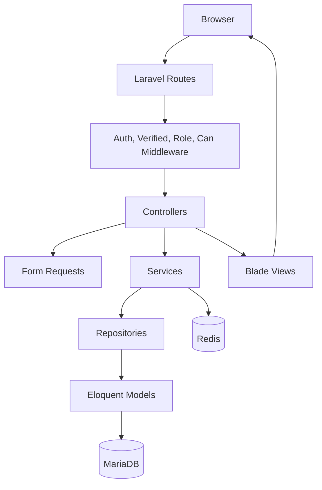
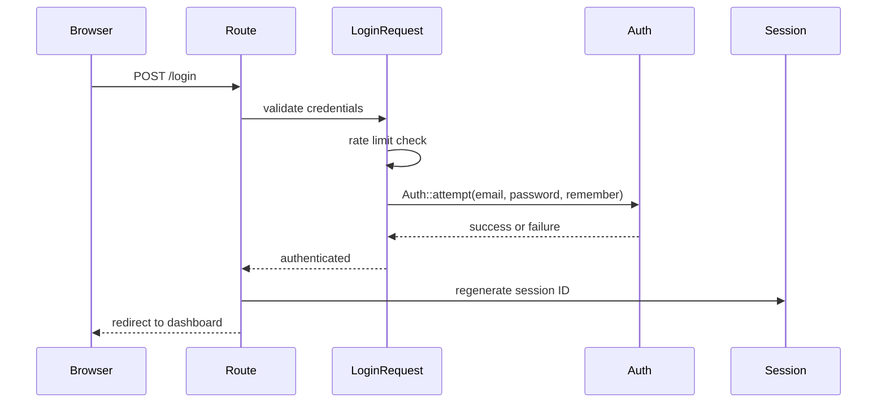
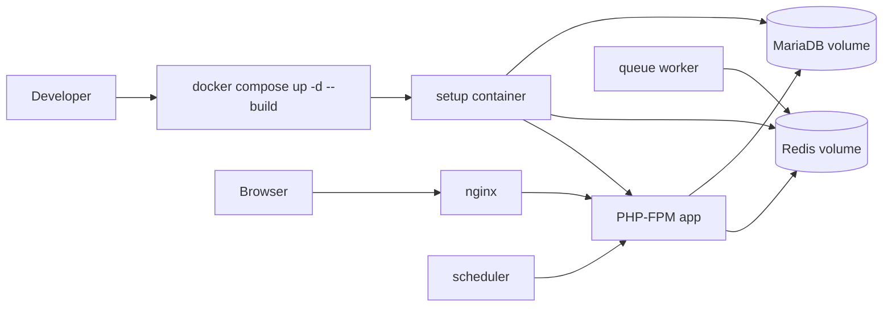
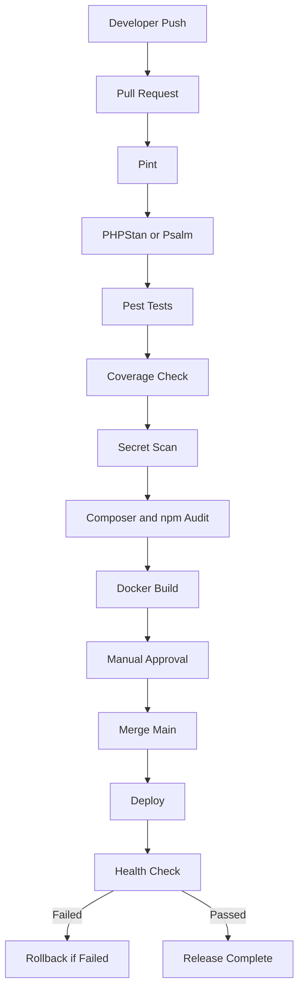

# Product Management Technical Report

Project: Laravel Product Management Application  
Review Date: 2026-06-22

## Table of Contents

1. [Executive Summary](#1-executive-summary)
2. [System Architecture](#2-system-architecture)
3. [Architecture Decisions](#3-architecture-decisions)
4. [Authentication and Authorization](#4-authentication-and-authorization)
5. [Product Management Module](#5-product-management-module)
6. [Challenges and Solutions](#6-challenges-and-solutions)
7. [Security and Performance](#7-security-and-performance)
8. [Testing Strategy](#8-testing-strategy)
9. [Deployment Strategy](#9-deployment-strategy)
10. [Code Quality Compliance](#10-code-quality-compliance)
11. [CI/CD Roadmap](#11-cicd-roadmap)
12. [Future Improvements](#12-future-improvements)
13. [Final Assessment](#13-final-assessment)
14. [PDF Generation](#14-pdf-generation)

## 1. Executive Summary

This Laravel project implements a product inventory management application with authenticated user access, role-based administration, product CRUD, search, filtering, pagination, rich text descriptions, Dockerized local deployment, and automated CI quality gates.

The main business problem solved is controlled product catalog management. Administrators can create, edit, and delete products. Standard users can view and search products. Product inventory status is derived automatically from quantity so users cannot persist inconsistent stock information.

### Technology Stack

| Area | Actual Implementation |
|---|---|
| Framework | Laravel Framework 13.16.1 |
| PHP | PHP 8.3, composer platform set to 8.3.31 in `composer.json` |
| Database | MariaDB via `mariadb` connection |
| Cache/session/queue | Redis in Docker; array/database options for host and tests |
| Frontend | Blade, Tailwind CSS, Vite, CKEditor 5 |
| Authentication | Laravel Breeze-style session authentication with email verification |
| Authorization | Laravel Gates/Policies plus custom `role` middleware |
| Testing | Pest/PHPUnit feature and unit tests |
| Docker | PHP-FPM app image, nginx, MariaDB, Redis, queue worker, scheduler, one-shot setup container |
| CI/CD | GitHub Actions quality and Docker build workflow in `.github/workflows/ci.yml` |

### Key Features Implemented

- Product CRUD with route model binding in `routes/web.php` and `ProductController`.
- Product business logic in `app/Services/ProductService.php`.
- Product persistence/search/filtering in `app/Repositories/ProductRepository.php`.
- Product validation in `app/Http/Requests/Product`.
- Role-based product permissions in `app/Policies/ProductPolicy.php`.
- Admin user role management through admin routes and `UserRoleService`.
- Rich text sanitization through `app/Services/RichTextSanitizer.php`.
- Docker startup automation through `docker/php/setup.sh` and `docker-compose.yml`.
- CI quality gates for Pint, raw SQL scanning, raw Blade output scanning, Composer audit, npm audit, tests, and Docker build.

### Overall Design Goals

The implementation aims for a layered Laravel architecture:

- Thin controllers.
- Server-side Form Request validation.
- Business logic in services.
- Database access in repositories.
- Centralized authorization through policies and middleware.
- Automated Docker setup for repeatable developer onboarding.

## 2. System Architecture

The application uses a traditional server-rendered Laravel architecture with a deliberately separated product module. HTTP requests enter through Laravel routes, are authorized by middleware/policies, validated by Form Requests, processed by services, persisted through repositories, and rendered through Blade views.

### Route Layer

Actual route definitions are in `routes/web.php` and `routes/auth.php`.

- `/dashboard` requires `auth` and `verified`.
- Product routes require `auth` and `verified`.
- Product create/store routes additionally require `can:create,App\Models\Product`.
- Product edit/update routes require `can:update,product`.
- Product destroy route requires `can:delete,product`.
- Admin routes are grouped under `/admin` and require `auth`, `verified`, and `role:admin`.
- Auth routes cover registration, login, logout, password reset, email verification, password confirmation, and password update.

### Controller Layer

Controllers are intentionally thin.

- `app/Http/Controllers/ProductController.php` handles authorization, request/response orchestration, and delegates product behavior to `ProductService`.
- Auth controllers use Form Requests and Laravel auth services.
- `ProfileController` handles profile update and account deletion.
- Admin controllers delegate dashboard metrics and role updates to services.

### Request Layer

Validation is centralized under `app/Http/Requests`:

- `Auth` requests validate login, registration, password reset, password update, and password confirmation.
- `Product` requests validate create/update/filter inputs.
- `Admin` requests validate user role updates.
- `User` requests validate profile update and account deletion.

### Service Layer

Services contain business rules:

- `ProductService` handles SKU generation, stock status derivation, duplicate SKU handling, and product lifecycle operations.
- `UserRoleService` prevents removal of the last administrator account.
- `AdminDashboardService` calculates admin dashboard metrics.
- `RichTextSanitizer` sanitizes product descriptions and strips CKEditor UI chrome from persisted content.

### Repository Layer

Repositories isolate persistence:

- `ProductRepository` owns product queries, filters, sorting, pagination, transactions, unique-SKU checks, and unique constraint detection.
- `UserRepository` owns user role listing/counting/update persistence.
- Interfaces are registered in `AppServiceProvider`.

### Policy and Middleware Layer

- `ProductPolicy` allows admins and standard users to view products, but only admins can create/update/delete.
- `EnsureUserHasRole` aborts with 403 unless the authenticated user has the required enum role.
- `AppServiceProvider` registers `ProductPolicy` and rate limiters.

### Model Layer

- `Product` casts `price`, `quantity`, `stock_status`, and `date_available`.
- `Product` uses Laravel's `#[Fillable]` attribute for mass assignment protection.
- `User` casts `password` as hashed and `role` as `UserRole`.
- `User` implements `MustVerifyEmail`.

### Docker Architecture

The Docker architecture contains:

- `setup`: one-shot bootstrap.
- `app`: PHP-FPM.
- `nginx`: HTTP entrypoint.
- `mariadb`: persistent database.
- `redis`: cache/session/queue backend.
- `queue`: Laravel queue worker.
- `scheduler`: Laravel scheduler worker.

### Application Architecture Diagram



## 3. Architecture Decisions

### 3.1 Repository Pattern

The repository pattern is implemented through:

- `app/Repositories/Contracts/ProductReadRepositoryInterface.php`
- `app/Repositories/Contracts/ProductWriteRepositoryInterface.php`
- `app/Repositories/Contracts/ProductRepositoryInterface.php`
- `app/Repositories/ProductRepository.php`
- Bindings in `app/Providers/AppServiceProvider.php`

The project separates reads and writes with read/write interfaces, which improves interface segregation. `ProductService` depends on abstractions:

```php
public function __construct(
    private readonly ProductReadRepositoryInterface $productReader,
    private readonly ProductWriteRepositoryInterface $productWriter,
) {}
```

This was chosen to keep database queries out of controllers and services. Search, filtering, sorting, pagination, transactions, and unique checks are implemented inside `ProductRepository`.

Benefits:

- Separation of concerns.
- Easier replacement of persistence logic.
- Improved testability through interface substitution.
- Cleaner product service focused on business rules rather than query construction.

Trade-off:

- More files and indirection than a simple CRUD controller.

### 3.2 Service Layer

`ProductService` owns the product business rules:

- Automatic SKU generation.
- Stock status derivation from quantity.
- Duplicate SKU validation exceptions.
- Retry handling for unique SKU collisions.

Example from `ProductService`:

```php
$payload['stock_status'] = StockStatus::fromQuantity((int) ($payload['quantity'] ?? 0));
```

This prevents controllers from owning inventory logic. The controller only calls:

```php
$product = $this->products->create($request->validated());
```

Benefits:

- Reusable business behavior.
- Thin controllers.
- Easier unit and feature testing.
- Centralized product invariants.

### 3.3 Form Request Validation

Validation is separated into Form Requests. `ProductFormRequest` sanitizes and normalizes product input in `prepareForValidation`, then validates SKU format, title, description, price, quantity, stock status, and date.

Example validation rule:

```php
'price' => ['bail', 'required', 'numeric', 'decimal:0,2', 'min:0.01', 'max:99999999.99'],
```

Benefits:

- Consistent validation.
- Controllers remain small.
- Request authorization can be enforced before controller execution.
- Rich text sanitization happens before persistence.

### 3.4 Policies and Authorization

`ProductPolicy` centralizes product permissions:

- Admin and standard users can view.
- Admin users can create, update, and delete.

Routes also apply `can` middleware for product actions. Controllers additionally call `Gate::authorize`, providing defense in depth.

### 3.5 Dependency Injection

The project uses constructor injection in controllers and services:

- `ProductController` receives `ProductService`.
- `ProductService` receives repository interfaces.
- `AdminDashboardService` and `UserRoleService` receive user repository interfaces.

Bindings are registered in `AppServiceProvider`, which keeps concrete implementation selection out of consuming classes.

## 4. Authentication and Authorization

### Authentication

The authentication implementation follows Laravel Breeze-style session authentication with Blade views and controllers in `app/Http/Controllers/Auth`.

Implemented flows:

- Registration: `RegisteredUserController`, `RegisteredUserRequest`.
- Login: `AuthenticatedSessionController`, `LoginRequest`.
- Logout: `AuthenticatedSessionController::destroy`.
- Forgot password: `PasswordResetLinkController`.
- Reset password: `NewPasswordController`.
- Password confirmation: `ConfirmablePasswordController`.
- Password update: `PasswordController`.
- Email verification: `EmailVerificationPromptController`, `VerifyEmailController`, and `EmailVerificationNotificationController`.
- Profile management: `ProfileController` with `ProfileUpdateRequest` and `DeleteUserRequest`.

### Login Security

`LoginRequest` applies validation and rate limiting:

- Required email/password.
- Email format validation.
- Five-attempt login throttling via `RateLimiter`.
- Remember-me support through `Auth::attempt($this->only('email', 'password'), $this->boolean('remember'))`.
- Session regeneration after successful login.

### Registration Security

`RegisteredUserRequest` uses Laravel password defaults. `AppServiceProvider` sets strong defaults:

```php
Password::defaults(fn () => Password::min(12)->mixedCase()->numbers()->symbols());
```

`User` also casts passwords as hashed. Registration explicitly uses `Hash::make`.

### Session Security

`config/session.php` enables:

- Encrypted sessions by default.
- HTTP-only cookies by default.
- SameSite `lax`.
- JSON serialization.

Docker uses Redis sessions through `docker-compose.yml`:

```yaml
SESSION_DRIVER: redis
SESSION_ENCRYPT: ${SESSION_ENCRYPT:-true}
```

### Authorization

Roles are modeled through `app/Enums/UserRole.php`:

- `Admin`
- `User`

`User` exposes:

```php
public function isAdmin(): bool
public function isStandardUser(): bool
```

Admin route protection is implemented in `routes/web.php`:

```php
Route::middleware(['auth', 'verified', 'role:admin'])
```

The custom role middleware is `app/Http/Middleware/EnsureUserHasRole.php`, registered in `bootstrap/app.php`.

### Authentication Flow Diagram



## 5. Product Management Module

### Product Entity

The product table is created by `database/migrations/2026_06_21_000001_create_products_table.php`.

Fields:

- `sku`: unique string, length 10.
- `title`: string, length 255.
- `description`: long text.
- `price`: decimal(10,2).
- `quantity`: unsigned integer.
- `stock_status`: string, length 20.
- `date_available`: date.
- Timestamps.

Indexes:

- Unique SKU.
- Single-column indexes on date, price, quantity, stock status, and title.
- Composite indexes on stock/date and price/quantity.
- Full-text index on SKU, title, and description.

### Product Model

`app/Models/Product.php` casts:

```php
'price' => 'decimal:2',
'quantity' => 'integer',
'stock_status' => StockStatus::class,
'date_available' => 'date',
```

Mass assignment is restricted with:

```php
#[Fillable(['sku', 'title', 'description', 'price', 'quantity', 'date_available'])]
```

`stock_status` is intentionally not fillable through user payloads. It is derived by the service.

### CRUD

CRUD is implemented through `ProductController`:

- `index(ProductFilterRequest $request)`
- `create()`
- `store(ProductStoreRequest $request)`
- `show(Product $product)`
- `edit(Product $product)`
- `update(ProductUpdateRequest $request, Product $product)`
- `destroy(Product $product)`

The controller uses route model binding for `Product $product`.

### SKU Rule

If a SKU is missing, `ProductService` generates the next SKU in `PRD-000001` format:

```php
return sprintf('PRD-%06d', $nextNumber);
```

It locks the latest SKU lookup during creation:

```php
$this->productReader->latestSku(lockForUpdate: true)
```

It retries SKU collision handling up to three attempts.

### Stock Status Rule

`StockStatus::fromQuantity` is the single source of stock status:

```php
return $quantity > 0 ? self::InStock : self::OutOfStock;
```

`ProductService` always recomputes `stock_status` during create/update, ignoring user-supplied status.

### Search

Search is implemented in `ProductRepository::paginate` across:

- `sku`
- `title`
- `description`

The search input is normalized and limited to 100 characters. LIKE wildcards are escaped in `escapeLike`.

### Filtering

Filters are validated by `ProductFilterRequest` and applied in `ProductRepository`.

Implemented filters:

- Stock status.
- Min/max price.
- Min/max quantity.
- Date available from/to.

Legacy aliases are also supported:

- `q` for search.
- `price_min` and `price_max`.
- `date_available` mapped to both date bounds.

### Sorting

Sorting is represented by `ProductSort` enum:

- Latest.
- Oldest.
- Price low to high.
- Price high to low.
- Quantity high to low.
- Title A-Z.

The repository applies only enum-backed whitelisted sort options.

### Pagination

`ProductRepository::paginate` returns a `LengthAwarePaginator` and calls `withQueryString`, preserving search/filter parameters across pages.

### Rich Text Description

Product descriptions use CKEditor in `resources/js/product-editor.js` and a textarea with `data-rich-text-editor` in `resources/views/products/partials/form.blade.php`.

Sanitization occurs before validation in `ProductFormRequest` and again when rendering through the custom Blade directive:

```php
@richText($product->description)
```

The sanitizer allows a restricted set of tags and removes CKEditor UI chrome that could be pasted into saved content.

## 6. Challenges and Solutions

### Challenge: Keeping Controllers Thin

Problem: Product CRUD, validation, search, filtering, SKU generation, and stock status rules could easily accumulate in `ProductController`.

Solution: The controller delegates to `ProductService`, while request validation lives in Form Requests and database access lives in `ProductRepository`.

Trade-off: More classes to maintain, but clearer boundaries and easier review.

### Challenge: Role-Based Authorization

Problem: Admins need write access, while standard users only need read access.

Solution: Use `ProductPolicy` for product permissions and `EnsureUserHasRole` for admin-only route groups.

Trade-off: Authorization exists both at route and controller levels. This is slightly repetitive but provides defense in depth.

### Challenge: Docker Fresh Setup

Problem: A cloned repository usually requires manual Laravel setup commands.

Solution: `docker/php/setup.sh` automates `.env` creation, key generation, dependency installation checks, frontend build, database wait, migrations, optional seeders, storage link, and cache warming.

Trade-off: The setup container does significant work at startup, so startup time is longer.

### Challenge: Rich Text Sanitization

Problem: Product descriptions need formatting, but rich text introduces XSS risk.

Solution: `RichTextSanitizer` uses HTMLPurifier with an explicit allowlist and URL scheme restrictions. Descriptions are sanitized before validation and before rendering.

Trade-off: Only a limited rich text feature set is allowed. Images, iframes, and arbitrary style attributes are not supported.

### Challenge: Search and Filtering

Problem: Search and filters must be secure and combinable.

Solution: `ProductFilterRequest` validates filter inputs, and `ProductRepository` applies Eloquent query constraints with escaped LIKE terms and enum-whitelisted sorting.

Trade-off: The migration defines a full-text index, but current search implementation uses LIKE rather than full-text search. This is simpler and portable but may need optimization at larger scale.

### Challenge: Testing Architecture

Problem: The module needs coverage for CRUD, validation, inventory logic, search, filters, and authorization.

Solution: Pest feature tests are organized under `tests/Feature/Product`, with additional auth/admin/user tests.

Trade-off: The CI workflow disables coverage collection and no coverage threshold is enforced.

## 7. Security and Performance

### 7.1 SQL Injection Protection

The product module uses Eloquent and query builder methods, not string-concatenated raw SQL.

Examples:

- `where('stock_status', $filters['stock_status'])`
- `where('price', '>=', $filters['min_price'])`
- `whereDate('date_available', '>=', $filters['date_from'])`

Search terms are normalized and wildcard-escaped before use in LIKE clauses:

```php
private function escapeLike(string $value): string
{
    return str_replace(['\\', '%', '_'], ['\\\\', '\\%', '\\_'], $value);
}
```

The CI workflow includes a raw SQL scan for unsafe methods such as `whereRaw`, `DB::raw`, `statement`, and `unprepared`.

### 7.2 XSS Protection

Blade uses escaped output by default through `{{ }}`.

Rich text output is handled through:

```php
@richText($product->description)
```

`RichTextSanitizer` uses HTMLPurifier with an allowlist:

- Paragraphs.
- Basic formatting.
- Lists.
- Links.
- Headings.
- Pre/code.

It allows only `http`, `https`, and `mailto` URL schemes. CI also scans for raw Blade output (`{!!`).

### 7.3 CSRF Protection

The application uses Laravel web middleware and Blade forms include `@csrf`.

Examples:

- Product form partial begins with `@csrf`.
- Product delete form includes `@csrf` and `@method('DELETE')`.
- Auth logout form includes `@csrf`.

No CSRF middleware bypass was found in inspected routes.

### 7.4 Mass Assignment Protection

`Product` uses:

```php
#[Fillable(['sku', 'title', 'description', 'price', 'quantity', 'date_available'])]
```

`User` uses:

```php
#[Fillable(['name', 'email', 'password'])]
```

The service/repository intentionally uses `forceFill` only after `ProductService` has reduced input with `Arr::only` and recomputed stock status. This is acceptable but should be treated as a privileged internal persistence path.

### 7.5 Authentication Security

Implemented protections:

- Session regeneration after login.
- Session invalidation and token regeneration on logout.
- Password hashing.
- Strong password defaults.
- Login throttling.
- Registration/password reset/password confirmation rate limiters.
- Email verification requirement for dashboard/product/admin route groups.

### 7.6 File Upload Security

No product file upload feature is implemented. Therefore, MIME and size validation are not applicable to the current product module. This should be added if product images or attachments are introduced.

### 7.7 Performance

Implemented performance controls:

- Pagination with query string preservation.
- Database indexes for SKU, date, price, quantity, stock status, title, and composite filter patterns.
- Redis configured for cache/session/queue in Docker.
- Production Docker image installs optimized Composer autoload.
- Optional Laravel cache warming through `RUN_OPTIMIZE=true`.

Potential performance gap:

- The migration defines a full-text index, but the repository uses LIKE search. Large catalogs should consider switching to database full-text search or a search service.

## 8. Testing Strategy

The project uses Pest/PHPUnit with tests under `tests/Feature` and `tests/Unit`.

Actual test count found by scanning test definitions: 92 tests.

### Test Structure

| Area | Files |
|---|---|
| Product CRUD | `tests/Feature/Product/ProductCrudPestTest.php` |
| Product validation | `tests/Feature/Product/ProductValidationPestTest.php` |
| Product inventory | `tests/Feature/Product/ProductInventoryPestTest.php` |
| Product search | `tests/Feature/Product/ProductSearchPestTest.php` |
| Product filtering/sorting | `tests/Feature/Product/ProductFilteringPestTest.php` |
| Product authorization | `tests/Feature/Product/ProductAuthorizationPestTest.php` |
| Auth | `tests/Feature/Auth/*` |
| Admin | `tests/Feature/Admin/*` |
| User access | `tests/Feature/User/UserAccessPestTest.php` |
| Sanitizer unit | `tests/Unit/RichTextSanitizerTest.php` |

### Testing Philosophy

The suite focuses on behavior:

- Users see the correct routes and pages.
- Admins can mutate products.
- Standard users cannot mutate products.
- Business rules persist correctly.
- Validation rejects invalid input.
- Search, filter, sort, and pagination behavior is verified at the HTTP layer.
- Rich text sanitization is verified both through product CRUD and a unit-level sanitizer test.

### Current Coverage Summary

The CI workflow runs:

```bash
php artisan test
```

However, `.github/workflows/ci.yml` configures PHP coverage as `none` and no coverage threshold is present in `phpunit.xml` or Composer scripts. Therefore, the project has a meaningful test suite but no measured or enforced coverage percentage.

### Coverage Gaps

- No explicit coverage threshold.
- No PHPStan/Psalm static analysis job.
- No browser/E2E test for dropdown/modal/rich-text editor UI behavior.
- No performance tests for large product catalogs.
- No tests for Docker setup scripts.

## 9. Deployment Strategy

The deployment setup is Docker Compose based.

### Containers

| Service | Responsibility |
|---|---|
| `setup` | One-shot application bootstrap |
| `app` | PHP-FPM runtime |
| `nginx` | HTTP ingress and static asset serving |
| `mariadb` | Persistent relational database |
| `redis` | Cache/session/queue backend |
| `queue` | Laravel queue worker |
| `scheduler` | Laravel scheduler worker |

### Startup Process

`docker/php/setup.sh` performs:

1. Creates writable directories.
2. Creates `.env` from `.env.example` if missing.
3. Validates production environment safety.
4. Generates APP_KEY in non-production if missing.
5. Installs Composer dependencies when needed.
6. Installs Node dependencies when needed.
7. Builds frontend assets.
8. Waits for MariaDB readiness.
9. Runs `php artisan migrate --force`.
10. Runs seeders only when `RUN_SEEDERS=true` and `CONFIRM_RUN_SEEDERS=yes`.
11. Runs `php artisan storage:link --force`.
12. Optionally warms Laravel caches when `RUN_OPTIMIZE=true`.
13. Writes a setup completion marker.

### Seeder Strategy

Seeders are disabled by default in Docker. They run only when both variables are explicitly set:

```env
RUN_SEEDERS=true
CONFIRM_RUN_SEEDERS=yes
```

`DatabaseSeeder` seeds default local users and creates products up to 100 total through `ProductService`, avoiding a runtime dependency on Faker in the production Docker image.

### Health Checks

Health checks are present for:

- MariaDB.
- Redis.
- App.
- nginx.
- Queue.
- Scheduler.

### Deployment Architecture Diagram



### Developer Deployment Command

The intended local deployment command is:

```bash
docker compose up -d --build
```

If named volumes must be reset:

```bash
docker compose down -v
docker compose up -d --build
```

## 10. Code Quality Compliance

| Requirement | Status | Evidence |
|---|---|---|
| PSR-12 | Mostly compliant | CI runs `vendor/bin/pint --test`; Pint has passed on recently edited files. |
| Thin controllers | Implemented for product module | `ProductController` delegates to `ProductService` and uses Form Requests. |
| Repository pattern | Implemented | Product and user repositories under `app/Repositories`, bound in `AppServiceProvider`. |
| Service layer | Implemented | `ProductService`, `UserRoleService`, `AdminDashboardService`, `RichTextSanitizer`. |
| Dependency injection | Implemented | Controllers/services use constructor-injected dependencies. |
| Form Request validation | Implemented | Requests organized under `app/Http/Requests/Auth`, `Admin`, `Product`, and `User`. |
| Policies | Implemented | `ProductPolicy` registered in `AppServiceProvider`. |
| Role middleware | Implemented | `EnsureUserHasRole` registered as `role`. |
| Mass assignment protection | Implemented | `#[Fillable]` attributes on `Product` and `User`. |
| SQL injection protection | Implemented with minor caveat | Eloquent/query builder used; CI raw SQL scan exists. |
| XSS protection | Implemented | Blade escaping, HTMLPurifier sanitizer, raw output CI scan. |
| CSRF protection | Implemented | Web forms include `@csrf`; no bypass found. |
| CI static analysis | Not implemented | No PHPStan/Psalm job in `.github/workflows/ci.yml`. |
| Coverage gate | Not implemented | CI uses `coverage: none`; no threshold configured. |
| Production deploy pipeline | Not implemented | CI builds Docker images but does not deploy. |

## 11. CI/CD Roadmap

### Existing CI Implementation

The project contains `.github/workflows/ci.yml`.

Implemented jobs:

- Quality gate on push to main/master and pull requests.
- MariaDB service.
- Redis service.
- PHP 8.3 setup.
- Node 22 setup.
- Composer install.
- npm install.
- Environment preparation.
- Frontend build.
- Pint formatting check.
- Raw SQL scan.
- Raw Blade output scan.
- Composer audit.
- npm audit.
- `php artisan test`.
- Docker Compose config validation.
- Docker image build.

### Missing CI/CD Capabilities

- PHPStan/Psalm static analysis.
- Test coverage reporting and threshold.
- Secret scanning.
- Artifact publishing.
- Deployment stage.
- Manual production approval.
- Automated post-deployment health checks.
- Rollback automation.

### Recommended Future Pipeline



### Roadmap Details

- Automated Testing: Continue running Pest, add coverage collection with Xdebug or PCOV.
- Static Analysis: Add PHPStan Larastan at a moderate level and increase strictness over time.
- Secret Detection: Add GitHub secret scanning, Gitleaks, or TruffleHog.
- Quality Gates: Require Pint, static analysis, audits, and tests before merge.
- Deployment Automation: Build and push Docker images to a registry, then deploy through a controlled environment.
- Rollback Strategy: Keep previous image tags and automate redeploying the last known healthy tag if health checks fail.

## 12. Future Improvements

### Architecture

- CI/CD maturation: Add static analysis, coverage gates, image publishing, and deployment approvals.
- Blue/green deployments: Reduce deployment downtime and allow safer rollback.
- Kubernetes: Valuable once workload scheduling, horizontal scaling, and service isolation exceed Docker Compose needs.
- Horizontal scaling: Run multiple PHP-FPM and queue replicas behind load balancers.
- Read replicas: Offload reporting/search-heavy reads from the primary MariaDB instance.
- Distributed caching: Expand Redis usage for frequently accessed product and dashboard data.
- Event-driven architecture: Emit product-created/product-updated events for audit logs, notifications, or integrations.
- Microservices evaluation: Consider only after clear domain boundaries and scaling pressure emerge.

### Security

- Audit logs: Track product and user-role changes for accountability.
- SSO: Support enterprise identity providers.
- OAuth providers: Add social or enterprise login if required by users.
- MFA: Protect administrator accounts.
- Security monitoring: Capture suspicious login attempts and privileged actions.

### Product Features

- Product categories: Improve catalog structure and filtering.
- Product images: Improve product presentation; requires secure file upload validation.
- Bulk operations: Enable efficient inventory management.
- Export features: Support CSV/XLSX reports for operations teams.
- Analytics dashboard: Add inventory and product performance visibility.
- Notifications: Alert admins for out-of-stock products.
- Activity logs: Show product history and accountability.

### Observability

- OpenTelemetry: Trace requests across app, database, Redis, and queues.
- Metrics: Track latency, error rate, queue depth, and database query performance.
- Structured logging: Improve production diagnosis.
- Alerting: Notify maintainers of failed health checks, high error rates, and queue failures.

## 13. Final Assessment

### Scores

| Category | Score | Rationale |
|---|---:|---|
| Architecture | 88/100 | Strong layered product module with services, repositories, policies, and Form Requests. |
| Security | 86/100 | Good validation, escaping, sanitization, CSRF, auth throttling, and CSP. File upload security is not applicable because uploads are not implemented. |
| Code Quality | 84/100 | Clear structure and Pint CI. Static analysis is not implemented. |
| Testing | 78/100 | Strong feature coverage breadth, but no measured coverage threshold or E2E UI tests. |
| Deployment | 82/100 | Docker automation is strong for local/dev. Production deployment pipeline is not implemented. |
| Maintainability | 87/100 | Dependency injection and interfaces improve maintainability. Some complexity is introduced by repository layering. |
| Scalability | 74/100 | Redis, queue, scheduler, and indexes help, but search and deployment architecture need evolution for SaaS scale. |

Overall score: 83/100.

### Strengths

- Product module has a clean separation of controller, request, service, repository, model, enum, and policy responsibilities.
- Business rules for SKU and stock status are centralized.
- Security controls are visible in code and CI.
- Docker setup automates most local onboarding work.
- CI exists and covers formatting, audits, tests, and Docker build.
- Tests cover the main product workflows and authorization scenarios.

### Weaknesses

- CI does not include static analysis.
- CI does not measure or enforce coverage.
- No production deployment job exists.
- No browser/E2E tests for JavaScript-driven UI.
- Product search currently uses LIKE despite the migration defining a full-text index.
- CKEditor GPL branding remains unless a valid commercial license key is provided.

### Recommendations

1. Add Larastan/PHPStan and fix issues incrementally.
2. Add coverage collection and set an initial realistic threshold.
3. Add E2E tests for login, product CRUD, dropdown/logout, and rich text editing.
4. Add a deployment workflow with registry publishing, approval gates, health checks, and rollback.
5. Evaluate full-text search usage or a dedicated search engine for large catalogs.
6. Add audit logging for administrator actions.

## 14. PDF Generation

This Markdown file is the source of truth for the technical report. The generated PDF deliverable should preserve:

- Section numbering.
- Table of contents.
- Page numbering.
- Tables.
- Code examples.
- Mermaid diagrams.

The PDF in this repository is generated from this report source.
